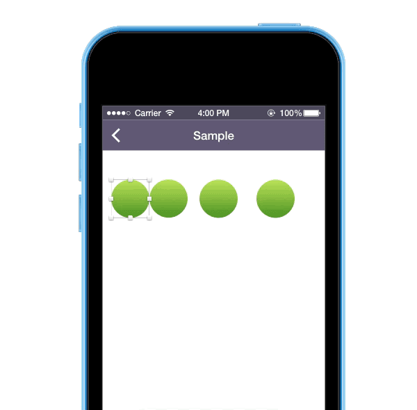

Sketch-DistributeWithSpace
=================
Plugin for Sketch that allows to distribute vertical and horizontal space between selected layers.

#Shortcuts
⌘ + ⌥ + ctrl + V — distribute vertical with space

⌘ + ⌥ + ctrl + H — distribute horizontal with space

